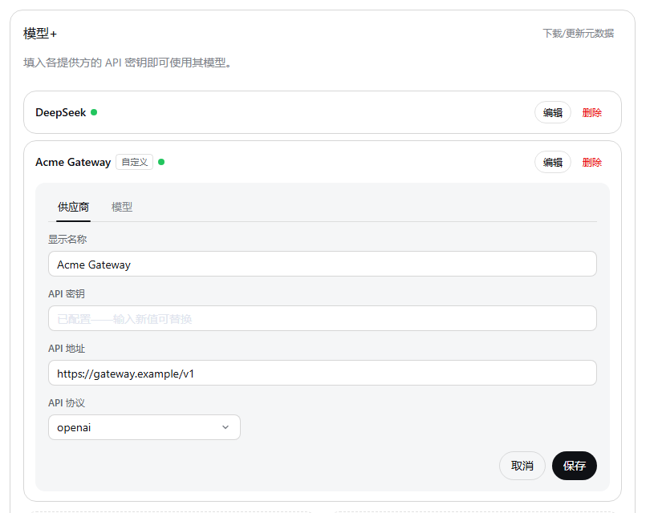
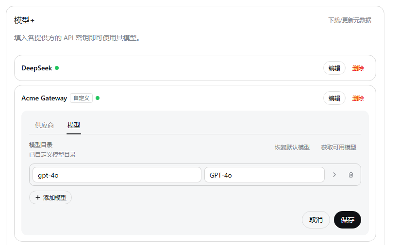

# dsh-model-extension
> 基于 deepseek-harness 的模型扩展插件

[](./LICENSE) [](https://www.npmjs.com/package/dsh-model-extension) [](https://github.com/deepseek-ai/deepseek-harness)

| 供应商 | 模型 |
| --- | --- |
|  |  |

> **作者建议（非AI编写）**
> 安装该插件或该类型插件：clone仓库源码 -> 执行安全检查/扫描 -> 从源码构建 -> 安装

## 功能

- 新增「模型+」设置导航（通过 bundle patch 禁用官方模型设置页，本页为唯一模型设置页）。
- 模型目录每行展开区新增扩展配置：
  - **推理挡位**（`reasoningEfforts`）：声明模型支持的思考档位（off/minimal/low/medium/high/xhigh/max）及线上取值；
  - **输入模态**（`input`）：text / image；
  - **兼容性**（`compat`）：`supportsReasoningEffort` 开关与 `thinkingFormat` 线制格式。
- 支持通过 `models.json` 元数据自动预填。可通过插件下载或自行下载并放到 `$DSH_HOME/models.json` 供插件使用。
    - **仅支持`https://models.dev/models.json`数据格式**。
- 所有保存走 DSH 原生 `settings.mutate`，落盘 `$DSH_HOME/settings.yaml`。

## 安装

```bash
dsh plugin --profile web add github:lovezi0/dsh-model-extension
```

仓库自带构建产物 `lib/`，安装即用、无需本地构建。

也可从 npm 安装（已发布至 npmjs）：

```bash
dsh plugin --profile web add dsh-model-extension
```

## 从源码构建

构建自包含——官方逻辑模块已 vendor 至 `src/client/vendor/`（`store` / `operations` / `schema-operations`，见文件头来源标注），无需 DeepSeek Harness 宿主源码：

```bash
npm install
npm run build
```

运行时 `dsh.adapter` 锚点仅作软校验：宿主版本与锚点不一致时记录告警并照常注册——宿主自身的 settings schema 校验与 revision fence 保证不兼容的写入会被拒绝而非损坏数据。

## 版本历史

- **1.0.0**
    - 🔥重构[模型+]界面
    - 🔥新增models.json元数据自动预填
    - 🔥禁用官方模型设置页（bundle patch id 覆盖）

- **outdated（0.x）** — 开放deepseek harness内置模型扩展参数；v0.x 历史，见 [CHANGELOG.md](./CHANGELOG.md)

## 许可

MIT。包含自 [deepseek-harness](https://github.com/deepseek-ai/deepseek-harness)（MIT）的 vendored 官方逻辑模块与派生代码。
