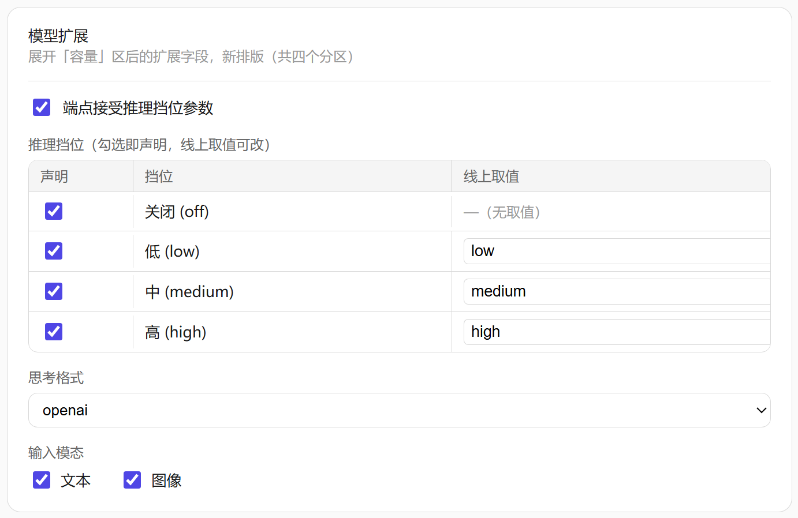

# dsh-model-extension
> 基于 deepseek-harness 的模型扩展插件




## 功能

- 新增「模型+」设置导航（与内置「模型」页并存，互不影响）。
- 页面标题显示当前适配的 DSH 版本。
- 模型目录每行展开区新增扩展配置：
  - **推理挡位**（`reasoningEfforts`）：声明模型支持的思考档位（off/minimal/low/medium/high/xhigh/max）及线上取值；
  - **输入模态**（`input`）：text / image；
  - **兼容性**（`compat`）：`supportsReasoningEffort` 开关与 `thinkingFormat` 线制格式。
- 所有保存走 DSH 原生 `settings.mutate`，落盘 `$DSH_HOME/settings.yaml`。

## 安装

```bash
dsh plugin --profile web add github:lovezi0/dsh-model-extension
```

仓库自带构建产物 `lib/`，安装即用、无需本地构建。

也可从 npm 安装（已发布至 npmjs）：

```bash
dsh plugin --profile web add dsh-model-extension
```

## 从源码构建

构建期需要 DeepSeek Harness 宿主源码（版本须与 `package.json` 的 `dsh.adapter` 锚点一致）：

1. 获取对应版本的 deepseek-harness 源码 checkout。
2. 在项目根创建 `build.local.yaml`（已被 gitignore，不会提交）：

   ```yaml
   deepseekHarness: <宿主源码绝对路径>
   ```

3. 构建：

   ```bash
   npm install
   npm run build
   ```

锚点与源码树版本不一致时构建会拒绝并提示两边值。

## 版本适配

插件运行时校验宿主版本与构建锚点严格一致；不一致则不注册并在日志中告警（插件其余部分不受影响）。升级 DSH 后需更新本插件源码适配漂移、修改 `dsh.adapter` 并重新构建。

## 版本历史

- **0.1.0**
    - 🔥新增[模型+]开启dsh隐藏设置

## 许可

MIT。包含自 [deepseek-harness](https://github.com/deepseek-ai/deepseek-harness)（MIT）官方插件的派生代码。
